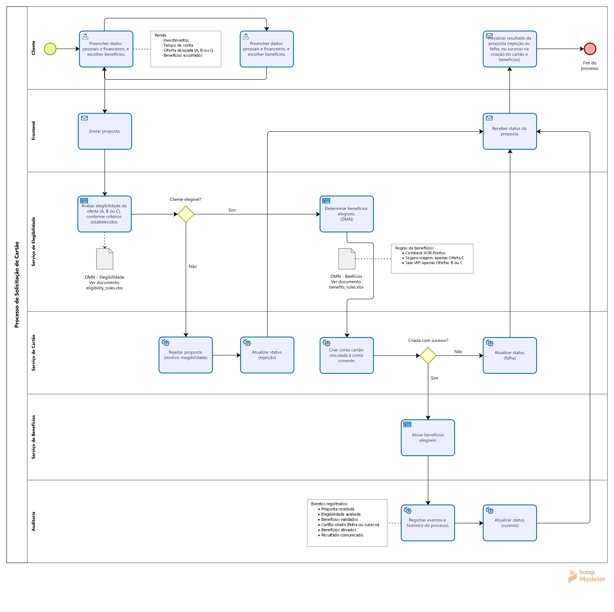

# Credit Card Request Process (BPMN + DMN)

## Overview
This project models a credit card request process using BPMN for orchestration and DMN concepts for decision logic.

> Note: DMN is represented via Excel spreadsheets only. Decision logic is NOT embedded in the BPMN diagram.

## Observations
- The BPMN diagram is available in the `diagrams/` directory
- DMN decision tables are documented as Excel files in the `dmn/` directory
- DMN is used conceptually (not executed within the BPMN tool)
- Clear separation of concerns (frontend, services, audit)
- Centralized status management
- Event-driven finalization (`PropostaFinalizada`)
- Non-blocking benefit validation (graceful degradation)

## Decisions
- Hit Policy: FIRST
- Benefits resolved via normalization (no rejection)
- Decision logic externalized from BPMN

## Diagram

